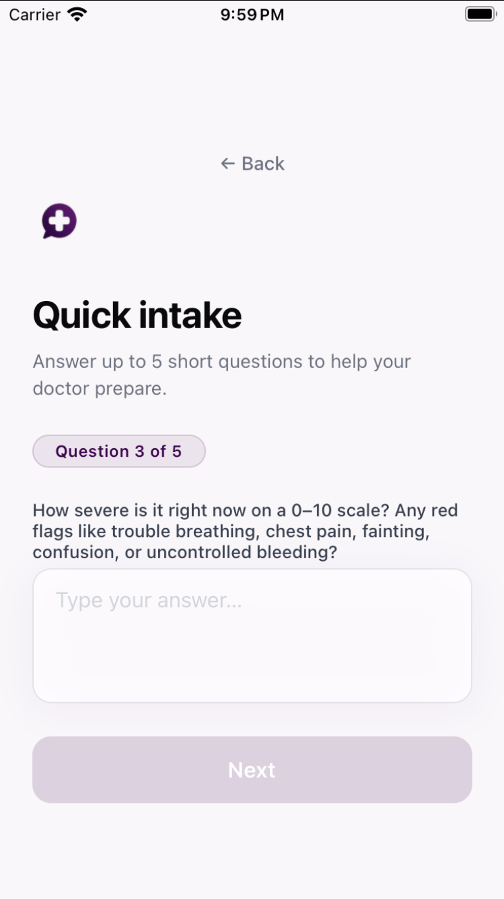
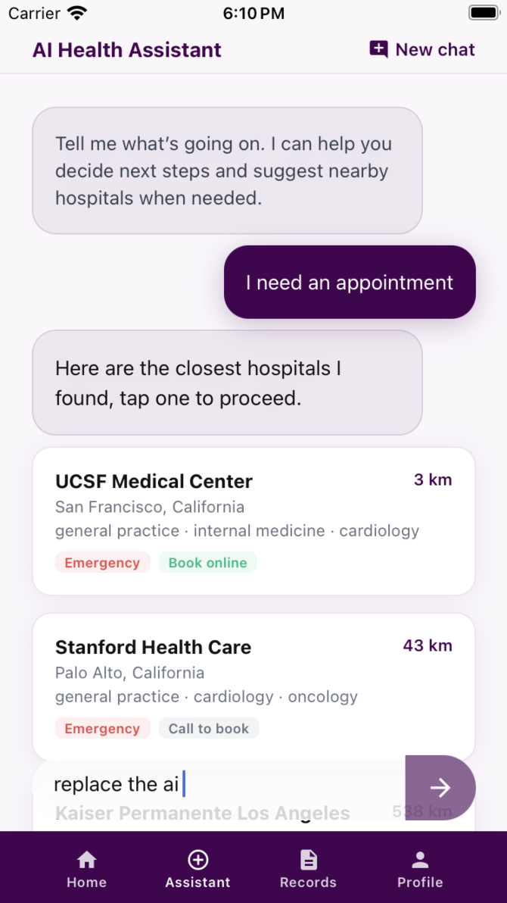
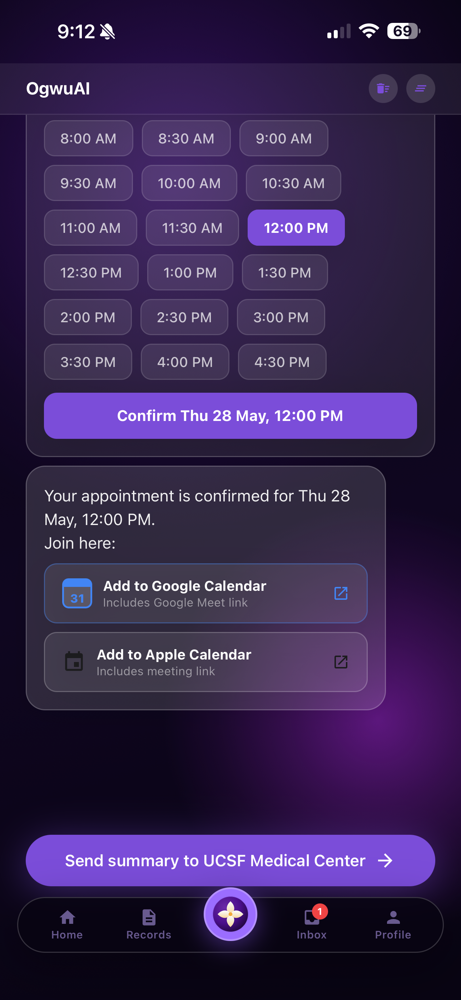
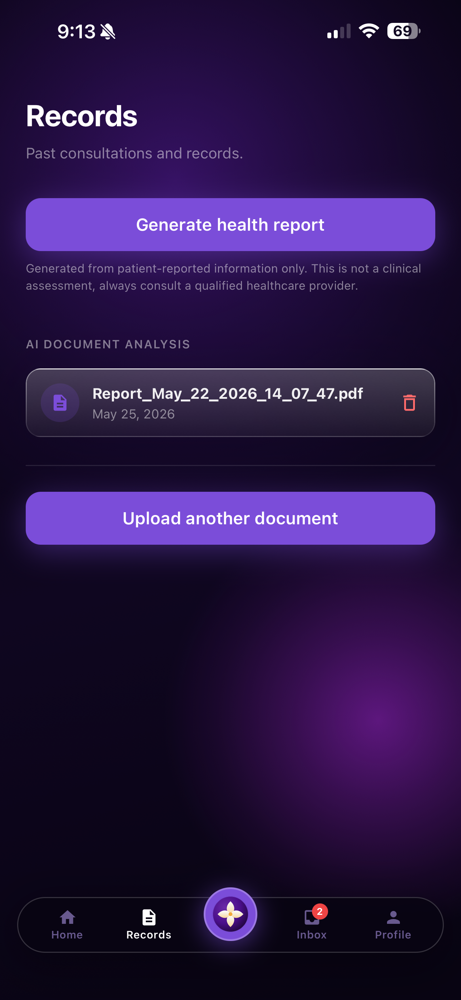
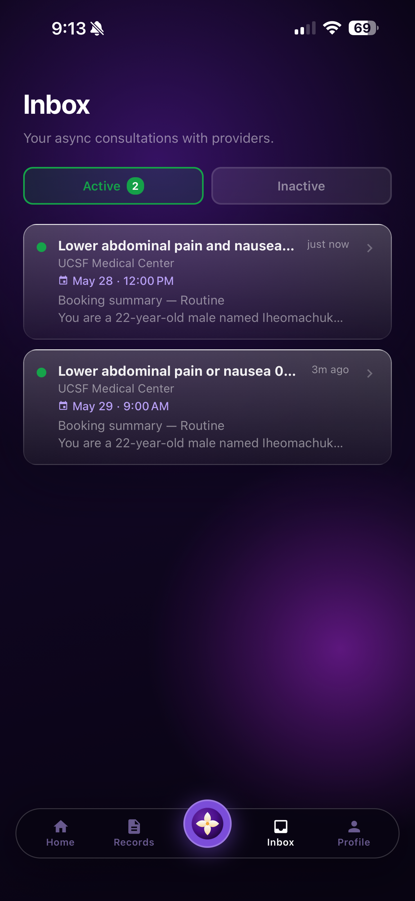

# Ogwu

AI-powered healthcare platform for patients in Nigeria and emerging markets. Patients complete a short triage, then chat with OgwuAI — a conversational agent that searches hospitals by GPS proximity, books appointments via Google Calendar, and injects their uploaded health records into context using RAG. Providers manage consults through a separate web admin dashboard.

Deployed on Railway. Database on Supabase Cloud. Distributed via TestFlight and APK.

---

## Screenshots

| Triage | OgwuAI agent |
|---|---|
|  |  |

| Booking confirmed | Health records |
|---|---|
|  |  |

| Inbox thread |
|---|
|  |

---

## Features

**Patient app · React Native / Expo**
- Phone OTP auth, onboarding, 6-language UI (English, Spanish, French, Igbo, Yoruba, Hausa)
- AI triage — 5-question interview, urgency classification across 5 tiers (self-care → emergency), safety notes
- OgwuAI health agent — hospital search ranked by GPS, Google Calendar slot availability, appointment booking with Google Meet link, drug interaction checks, emergency escalation, patient history and consult retrieval
- Health record RAG — upload PDFs or images → AWS Textract extracts text → chunks embedded via OpenAI → pgvector similarity search injects relevant content into every agent request
- Document library — view and delete uploaded health records from the Records tab
- Push notifications when a provider replies to a consult thread
- Async consultation inbox — open and closed thread tabs, appointment date display, provider reply indicator, cancel-consult option

**Agent architecture · Node.js / LangGraph**
- Stateful directed graph — one node per tool, conditional emergency routing, Postgres checkpointing for fault-tolerance
- 8 tools with Zod-validated inputs: `searchHospitals`, `getHospitalBookingInfo`, `bookAppointment`, `checkDrugInteraction`, `flagEmergency`, `getPatientHistory`, `getConsultHistory`, `createConsult`
- LlamaGuard content safety + OpenAI moderation on every user message and agent response
- Triage pipeline: rule-based urgency classification (self-care → emergency) with keyword matching, negation stripping, and severity scoring
- 60-case eval suite with 85% pass threshold; auto-runs on CI against key backend files

**AWS services**
- **Textract** — PDF/image text extraction from uploaded health records
- **S3** — patient document storage with presigned upload URLs
- **Lambda + SQS** — async ingestion pipeline: extract → chunk → embed → pgvector
- **SES** — emergency alert emails to hospital admins

---

## Next: WhatsApp agent

The next stage extends OgwuAI to WhatsApp via the Meta Business API — no app install required. Patients in markets with low smartphone penetration send messages through WhatsApp; the same LangGraph agent, tool set, and hospital directory power the experience end-to-end.

---

## Local setup

### Backend

```bash
cd backend
npm install
npm run dev
```

Required environment variables:

```
SUPABASE_URL
SUPABASE_SERVICE_ROLE_KEY
OPENAI_API_KEY
GOOGLE_OAUTH_CLIENT_ID
GOOGLE_OAUTH_CLIENT_SECRET
GOOGLE_OAUTH_REDIRECT_URI
DATABASE_URL          # Supabase Postgres connection string — used by LangGraph checkpointer
AWS_REGION            # e.g. us-east-1
AWS_ACCESS_KEY_ID
AWS_SECRET_ACCESS_KEY
S3_BUCKET
OPENAI_MODEL          # optional, defaults to gpt-4o-mini
```

### Mobile

```bash
cd mobile
npm install
npx expo start
```

Required environment variables:

```
EXPO_PUBLIC_SUPABASE_URL
EXPO_PUBLIC_SUPABASE_ANON_KEY
EXPO_PUBLIC_API_URL   # backend base URL — use LAN IP (not localhost) on physical devices
```

### Database

```bash
supabase login
supabase link --project-ref <your-project-ref>
supabase db push
```

---

## License

MIT
